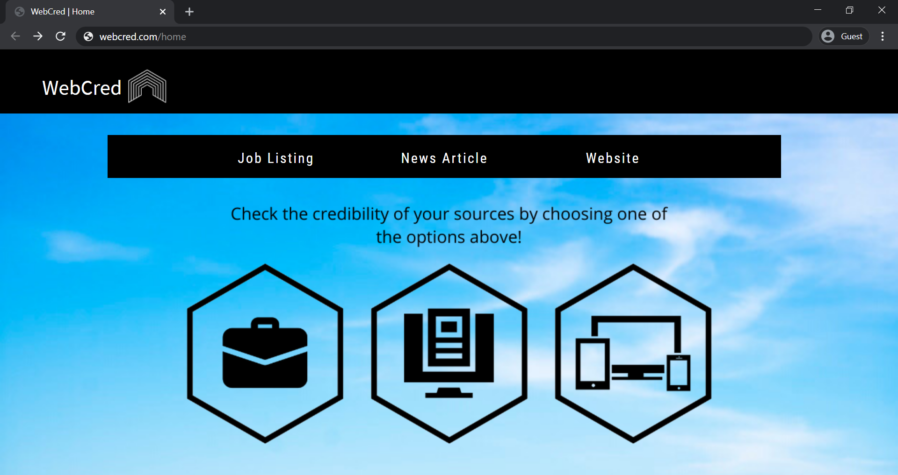
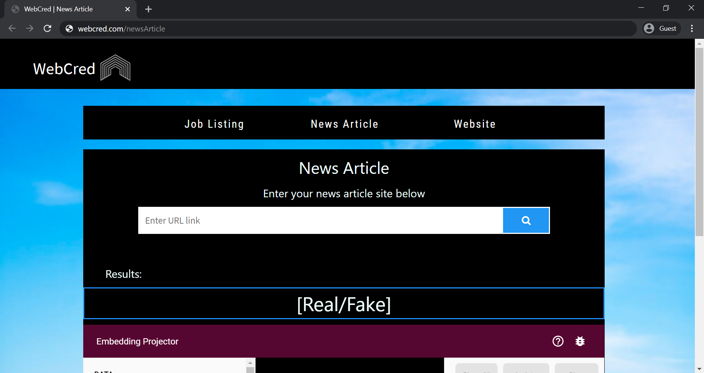
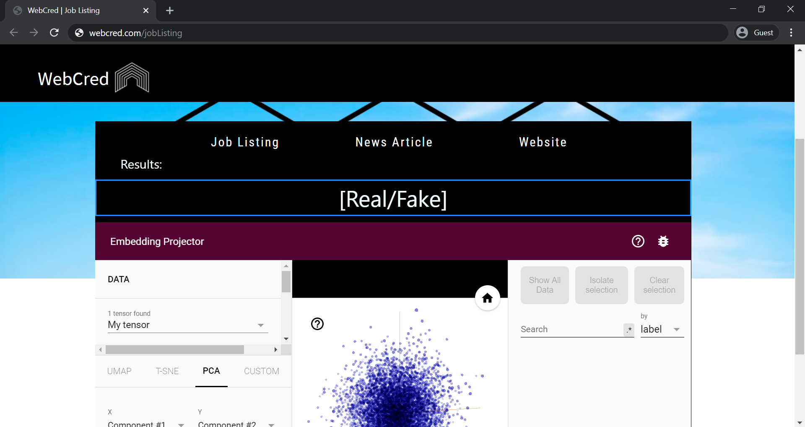

# WebCred | Data Day Grind Hackathon

Our devpost submission can be found here: https://devpost.com/software/webcred-o6q8fh

## Inspiration
As the internet expands, people with malicious intent will also naturally increase. It’s important to keep every internet user safe; especially the more vulnerable. One of the most prevalent ways that people are entrapped into giving away financial or personal details is with Fake Job listings.

## How it works
**General.** 
On the main page the user is prompted to enter a URL for a news article, job listing, or any general webpage. We then use HTTP requests with Beautiful Soup to parse and extract the relevant details from the webpage. These details are then transferred to our back-end through Flask; Three Natural Language Processing Neural Networks will then extract various text features and present them to the user. 

**How the Natural Language Processing Works.**
Between the 3 NLP models, we used 125,000+ units of data (strings) to train and validate the networks. These strings are tokenized (mapped to a unique integer), padded (truncated and concatenated to have a common size), and passed into a recurrent neural network for training. After training the model is exported and used for future predictions.

When Flask passes a string, tokenization and padding is applied. The padded sequence is then passed to the trained model and Predictions are made. These predictions and the associated confidence is then returned to the user through Flask.

We acquired data came the famous IMDB Dataset for sentiment analysis, the “Employment Scam Aegean Dataset” from The University of the Aegean | Laboratory of Information & Communication Systems Security for fake Job Listing Detection, and “Fake and real news dataset” from Clément Bisaillon on Kaggle for fake news detection.

(See Python Natural Language Processing Flowchart)

## Challenges we ran into

Our initial NLP model used a simple Dense Neural Network (DNN) following embedding. With this technique we were observing around 70-80% accuracy on our validation data. Although this level of detection is Statistically Significant, it results in a relatively high chance of a False Prediction. We reasoned that this was due to word order not being a factor in the network's predictions. To solve this issue we implemented a Recurrent Neural Network (RNN) with Bidirectional LSTMs (Long Short Term Memory) to allow for all words in the sentence to affect each other. After making this modification we had our validation accuracy increased to 96%+ which is a significant improvement over our simple DNN.

We wanted to help enable visitors to visually understand our models, but we didn’t know how to represent such an abstract concept. We eventually were able to integrate a TensorBoard Embedded Projector, which provides [data visualization](https://projector.tensorflow.org/?config=https://gist.githubusercontent.com/Pranish-Pantha/00d094012649715bce020d9ae8382f45/raw/9efadc5c8eb2c442db6b107534cf09ba92bd5186/proj.json) by mapping the labels to values in vector space.

## What's next for WebCred
We want to be able to expand our site to handle a broader range of data sources in order to ensure user dependability of our site. We’d also like to add a classification system (using graphs, charts, lists) that informs the users of what percent of the source is credible. We believe this feature can improve the overall awareness of different types of online sources and can allow users to decide whether or not to use their preferred websites.

## Our Website: Home - Landing Page

## Job Listing Page

## News Article Page

## Website Page

## Sample Results Screen

##  Python Natural Language Processing Flowchart

